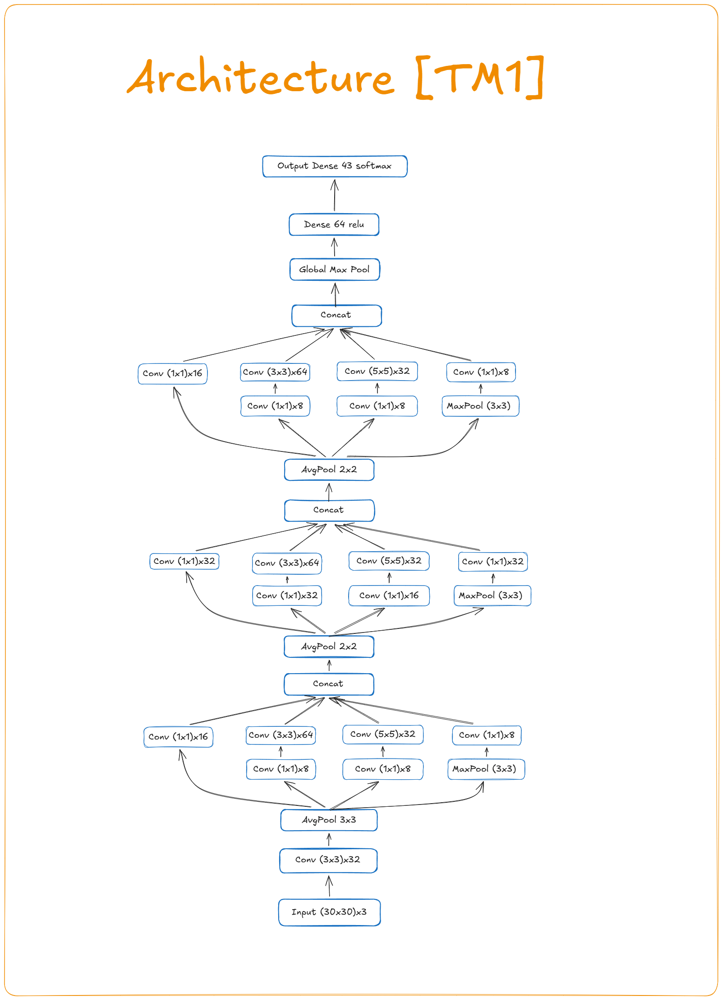
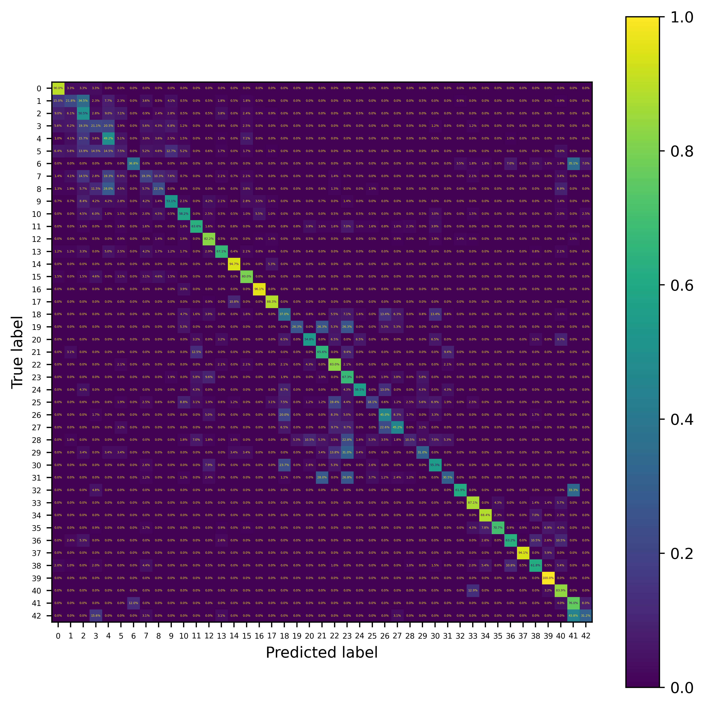
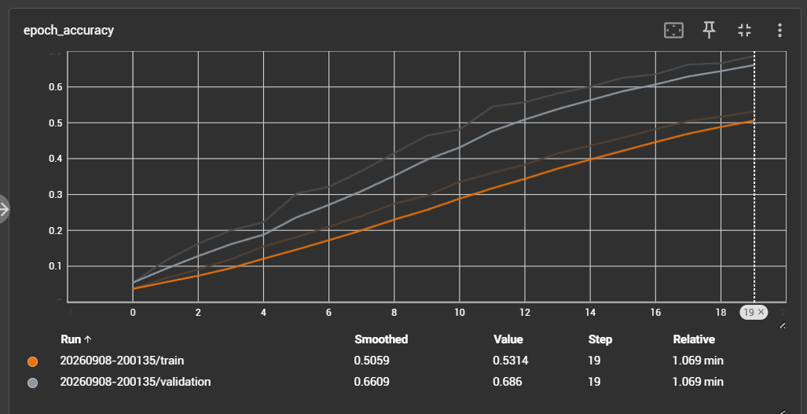
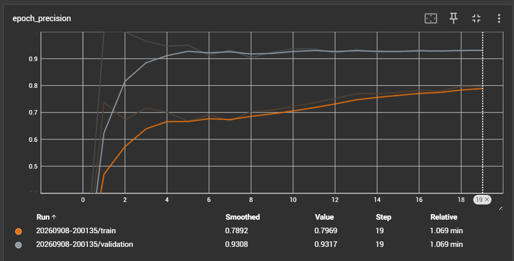
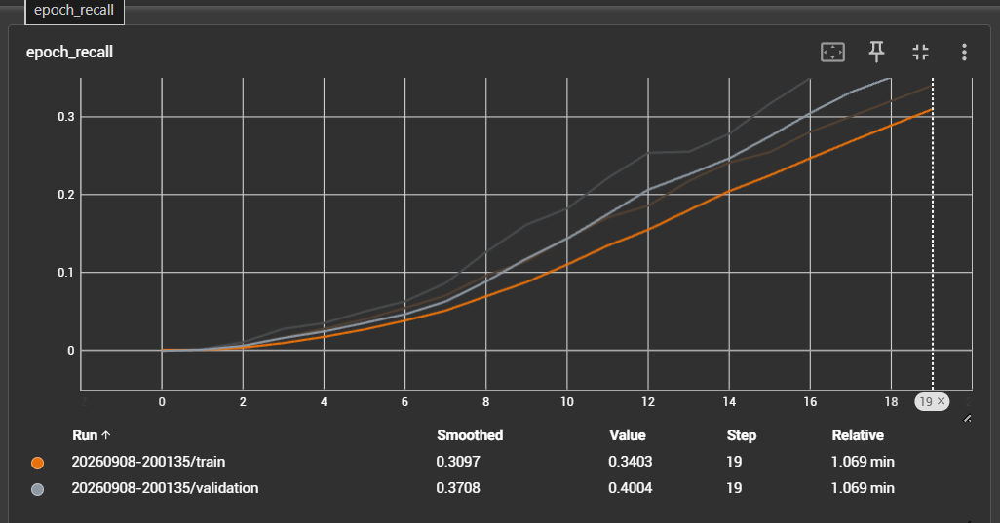
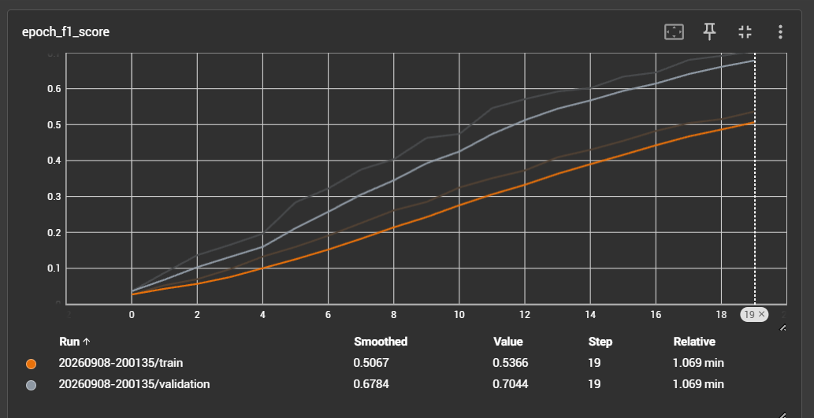
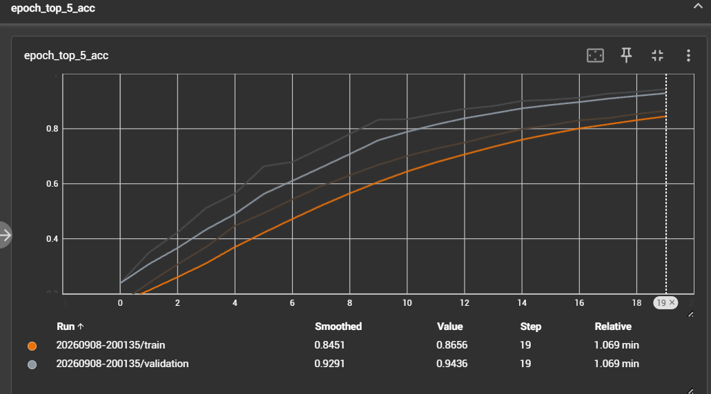

NOTE : I didn't train the model to the full potential just to demonstrate the Quality of the Architecture after so many Retries.

It is a total 10 Layers {8(7conv+1dense)+2  input/output} Neural Network which works on the principal of parallel feature extraction and 1x1 convolution bottlenecks which improve efficiency by a large amount.

Model Used : GoogleNet Inception (miniaturized by me)

## Architecture
<a href = "Architecture.excalidraw.png"></img></a>

## RESULTS : 

After 20 EPOCHS :  

209/209 - 4s - 19ms/step - **accuracy**: 0.7048 - **f1_score**: 0.7352 - loss: 1.1292 - **precision**: 0.9348 - **recall**: 0.4176 - **top_5_acc**: 0.9441

## Tensorboard Profile

### Accuracy over Epochs 

### Precision over Epochs

### Recall over Epochs

### F1-score over Epochs

### TOP-5 Accuracy over Epochs

